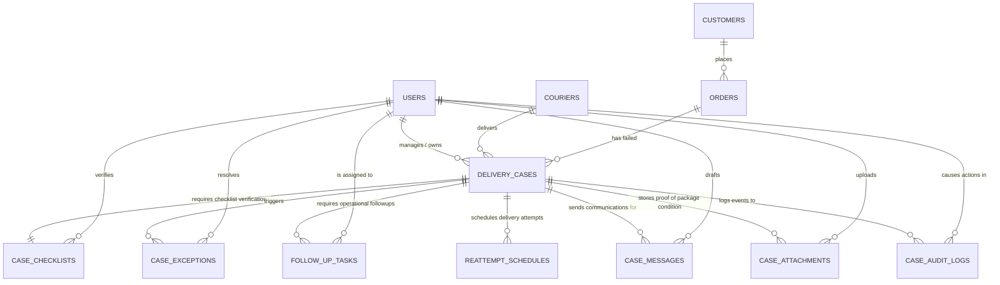

# Relational Database Design & Data Models

This document presents the Logical Data Model, Entity-Relationship (ER) Diagram, Physical Data Model (DDL SQL), and Design & Normalization Analysis for the **AI-Assisted Delivery Failure and Reattempt Coordination Workflow** system.

---

## 1. Logical Data Model

The database is structured to support all required workflows while strictly maintaining relational integrity and avoiding unstructured JSON columns. Below is the detailed breakdown of the logical entities, their attributes, keys, and descriptions.

### 1.1 `users` (System Users / Operators)
Represents the back-office operations analysts, customer support executives, and delivery coordination associates.

| Attribute | Data Type | Key | Nullability | Description |
| :--- | :--- | :--- | :--- | :--- |
| `user_id` | UUID | PK | NOT NULL | Unique identifier for the user. |
| `email` | VARCHAR(255) | Unique | NOT NULL | Business email address (used for login). |
| `full_name` | VARCHAR(255) | - | NOT NULL | User's full name. |
| `role` | VARCHAR(50) | - | NOT NULL | Role of the user: `'analyst'`, `'support'`, or `'associate'`. |
| `created_at` | TIMESTAMP | - | NOT NULL | Timestamp when the user was created. |
| `updated_at` | TIMESTAMP | - | NOT NULL | Timestamp when the user details were last updated. |

### 1.2 `customers` (Online Retail Customers)
Contains details of the customers who placed the orders.

| Attribute | Data Type | Key | Nullability | Description |
| :--- | :--- | :--- | :--- | :--- |
| `customer_id` | UUID | PK | NOT NULL | Unique identifier for the customer. |
| `full_name` | VARCHAR(255) | - | NOT NULL | Customer's full name. |
| `email` | VARCHAR(255) | Unique | NULL | Customer's email address. |
| `phone` | VARCHAR(50) | - | NOT NULL | Customer's primary contact number. |
| `created_at` | TIMESTAMP | - | NOT NULL | Timestamp when the record was created. |
| `updated_at` | TIMESTAMP | - | NOT NULL | Timestamp when the record was last updated. |

### 1.3 `couriers` (Courier Partners)
Represents delivery agencies or courier companies carrying out shipping.

| Attribute | Data Type | Key | Nullability | Description |
| :--- | :--- | :--- | :--- | :--- |
| `courier_id` | UUID | PK | NOT NULL | Unique identifier for the courier. |
| `company_name` | VARCHAR(255) | Unique | NOT NULL | Name of the courier partner (e.g., DHL, FedEx). |
| `contact_email` | VARCHAR(255) | - | NULL | Support email of the courier. |
| `contact_phone` | VARCHAR(50) | - | NULL | Support contact number of the courier. |
| `status` | VARCHAR(50) | - | NOT NULL | Status of the partner: `'active'` or `'inactive'`. |
| `created_at` | TIMESTAMP | - | NOT NULL | Timestamp when the record was created. |
| `updated_at` | TIMESTAMP | - | NOT NULL | Timestamp when the record was last updated. |

### 1.4 `orders` (Retail Orders)
Represents orders placed by customers.

| Attribute | Data Type | Key | Nullability | Description |
| :--- | :--- | :--- | :--- | :--- |
| `order_id` | UUID | PK | NOT NULL | Unique identifier for the order. |
| `order_number` | VARCHAR(100) | Unique | NOT NULL | User-visible unique order reference number. |
| `customer_id` | UUID | FK | NOT NULL | References `customers(customer_id)`. |
| `product_category` | VARCHAR(100) | - | NOT NULL | Category of products (e.g., Electronics, Fashion). |
| `order_date` | TIMESTAMP | - | NOT NULL | Timestamp when the order was placed. |
| `total_amount` | DECIMAL(10,2) | - | NOT NULL | Total financial value of the order. |
| `shipping_address` | TEXT | - | NOT NULL | The delivery address associated with the order. |
| `created_at` | TIMESTAMP | - | NOT NULL | Record creation timestamp. |
| `updated_at` | TIMESTAMP | - | NOT NULL | Record update timestamp. |

### 1.5 `delivery_cases` (Failed Delivery Coordination Cases)
The core operational entity tracking delivery failure cases.

| Attribute | Data Type | Key | Nullability | Description |
| :--- | :--- | :--- | :--- | :--- |
| `case_id` | UUID | PK | NOT NULL | Unique identifier for the case. |
| `order_id` | UUID | FK | NOT NULL | References `orders(order_id)`. |
| `courier_id` | UUID | FK | NOT NULL | References `couriers(courier_id)`. |
| `owner_id` | UUID | FK | NULL | References `users(user_id)`. Current owner. |
| `failure_reason` | VARCHAR(50) | - | NOT NULL | Reason: `'customer_unavailable'`, `'phone_not_reachable'`, `'incorrect_address'`, `'incomplete_address'`, `'customer_refused_delivery'`, `'package_damaged'`, `'courier_delay'`, `'return_to_warehouse_required'`. |
| `status` | VARCHAR(50) | - | NOT NULL | Status: `'New'`, `'Pending Customer'`, `'Pending Courier'`, `'Reattempt Scheduled'`, `'Reattempt Completed'`, `'Returned to Warehouse'`, `'Resolved'`, `'Closed'`. |
| `attempt_date` | TIMESTAMP | - | NOT NULL | Date when the first delivery attempt failed. |
| `courier_remarks` | TEXT | - | NULL | Raw remarks or text notes provided by the courier driver. |
| `ai_summary` | TEXT | - | NULL | AI-generated summary of the case and resolution path. |
| `created_at` | TIMESTAMP | - | NOT NULL | Record creation timestamp. |
| `updated_at` | TIMESTAMP | - | NOT NULL | Record update timestamp. |

### 1.6 `case_checklists` (Verification Checklist Checklist)
Tracks the status of case verification steps.

| Attribute | Data Type | Key | Nullability | Description |
| :--- | :--- | :--- | :--- | :--- |
| `checklist_id` | UUID | PK | NOT NULL | Unique identifier for the checklist. |
| `case_id` | UUID | FK, Unique | NOT NULL | References `delivery_cases(case_id)` (1-to-1). |
| `customer_contact_available` | BOOLEAN | - | NOT NULL | True if customer contact details are verified and valid. |
| `address_completeness_checked` | BOOLEAN | - | NOT NULL | True if shipping address structure is checked. |
| `courier_remarks_captured` | BOOLEAN | - | NOT NULL | True if raw courier remarks are recorded. |
| `reattempt_eligibility_confirmed`| BOOLEAN | - | NOT NULL | True if the package is eligible for another attempt. |
| `next_action_selected` | BOOLEAN | - | NOT NULL | True if a clear next step is assigned. |
| `updated_by` | UUID | FK | NULL | References `users(user_id)`. Who last updated this checklist. |
| `updated_at` | TIMESTAMP | - | NOT NULL | Timestamp when the checklist was updated. |

### 1.7 `case_exceptions` (System & Operator Flagged Exceptions)
Identifies anomalies preventing resolution or reattempt.

| Attribute | Data Type | Key | Nullability | Description |
| :--- | :--- | :--- | :--- | :--- |
| `exception_id` | UUID | PK | NOT NULL | Unique identifier. |
| `case_id` | UUID | FK | NOT NULL | References `delivery_cases(case_id)`. |
| `exception_type` | VARCHAR(50) | - | NOT NULL | Type: `'missing_customer_contact'`, `'incomplete_address'`, `'unclear_courier_remarks'`, `'reattempt_limit_reached'`, `'damaged_package_photo_missing'`, `'customer_confirmation_pending'`. |
| `description` | TEXT | - | NOT NULL | Operator details or AI justification for the exception. |
| `is_resolved` | BOOLEAN | - | NOT NULL | Resolution flag. Default `FALSE`. |
| `resolved_at` | TIMESTAMP | - | NULL | Timestamp when resolved. |
| `resolved_by` | UUID | FK | NULL | References `users(user_id)` who resolved it. |
| `created_at` | TIMESTAMP | - | NOT NULL | Timestamp when exception was raised. |

### 1.8 `follow_up_tasks` (Case Follow-Up Tasks)
Action items created to drive case progression.

| Attribute | Data Type | Key | Nullability | Description |
| :--- | :--- | :--- | :--- | :--- |
| `task_id` | UUID | PK | NOT NULL | Unique identifier. |
| `case_id` | UUID | FK | NOT NULL | References `delivery_cases(case_id)`. |
| `priority` | VARCHAR(50) | - | NOT NULL | Priority: `'Low'`, `'Medium'`, `'High'`, `'Urgent'`. |
| `owner_id` | UUID | FK | NOT NULL | References `users(user_id)`. Owner of the task. |
| `due_date` | TIMESTAMP | - | NOT NULL | Date by which task must be completed. |
| `required_action` | TEXT | - | NOT NULL | Detailed action to perform. |
| `status` | VARCHAR(50) | - | NOT NULL | Status: `'Todo'`, `'In Progress'`, `'Completed'`, `'Cancelled'`. |
| `created_at` | TIMESTAMP | - | NOT NULL | Timestamp when task was created. |
| `updated_at` | TIMESTAMP | - | NOT NULL | Timestamp when task was last updated. |

### 1.9 `reattempt_schedules` (Delivery Reattempts)
Schedules and details of delivery reattempts.

| Attribute | Data Type | Key | Nullability | Description |
| :--- | :--- | :--- | :--- | :--- |
| `schedule_id` | UUID | PK | NOT NULL | Unique identifier. |
| `case_id` | UUID | FK | NOT NULL | References `delivery_cases(case_id)`. |
| `scheduled_date` | TIMESTAMP | - | NOT NULL | Target date/time for the reattempt. |
| `preferred_slot` | VARCHAR(50) | - | NULL | Delivery window: `'Morning'`, `'Afternoon'`, `'Evening'`. |
| `special_instructions` | TEXT | - | NULL | Operator notes for delivery rider (e.g. 'call before arrival'). |
| `status` | VARCHAR(50) | - | NOT NULL | Status: `'Scheduled'`, `'Dispatched'`, `'Delivered'`, `'Failed'`. |
| `courier_remarks` | TEXT | - | NULL | Notes recorded by the courier after the reattempt. |
| `created_at` | TIMESTAMP | - | NOT NULL | Record creation timestamp. |
| `updated_at` | TIMESTAMP | - | NOT NULL | Record update timestamp. |

### 1.10 `case_messages` (Customer & Courier Messages/Drafts)
Tracks LLM-assisted messages.

| Attribute | Data Type | Key | Nullability | Description |
| :--- | :--- | :--- | :--- | :--- |
| `message_id` | UUID | PK | NOT NULL | Unique identifier. |
| `case_id` | UUID | FK | NOT NULL | References `delivery_cases(case_id)`. |
| `recipient_type` | VARCHAR(50) | - | NOT NULL | Recipient: `'Customer'`, `'Courier'`, `'Warehouse'`, `'Internal'`. |
| `message_channel` | VARCHAR(50) | - | NOT NULL | Channel: `'Email'`, `'SMS'`, `'WhatsApp'`, `'Internal Note'`. |
| `draft_content` | TEXT | - | NOT NULL | Original AI-generated draft content. |
| `final_content` | TEXT | - | NULL | Final message content modified or approved by user. |
| `status` | VARCHAR(50) | - | NOT NULL | Status: `'Draft'`, `'Sent'`, `'Failed'`. |
| `created_by` | UUID | FK | NOT NULL | References `users(user_id)` who triggered generation. |
| `created_at` | TIMESTAMP | - | NOT NULL | Message creation timestamp. |
| `updated_at` | TIMESTAMP | - | NOT NULL | Message update timestamp. |

### 1.11 `case_attachments` (Attachments e.g. damaged photo)
Attachments linked to the delivery case.

| Attribute | Data Type | Key | Nullability | Description |
| :--- | :--- | :--- | :--- | :--- |
| `attachment_id` | UUID | PK | NOT NULL | Unique identifier. |
| `case_id` | UUID | FK | NOT NULL | References `delivery_cases(case_id)`. |
| `file_name` | VARCHAR(255) | - | NOT NULL | Name of the file. |
| `file_type` | VARCHAR(100) | - | NOT NULL | MIME Type (e.g. `'image/jpeg'`). |
| `file_url` | VARCHAR(500) | - | NOT NULL | Storage locator URL. |
| `uploaded_by` | UUID | FK | NOT NULL | References `users(user_id)`. |
| `created_at` | TIMESTAMP | - | NOT NULL | Upload timestamp. |

### 1.12 `case_audit_logs` (Audit History Trail)
Maintains audit trail. No JSON.

| Attribute | Data Type | Key | Nullability | Description |
| :--- | :--- | :--- | :--- | :--- |
| `log_id` | UUID | PK | NOT NULL | Unique identifier. |
| `case_id` | UUID | FK | NOT NULL | References `delivery_cases(case_id)`. |
| `user_id` | UUID | FK | NOT NULL | References `users(user_id)`. Who performed action. |
| `action_type` | VARCHAR(50) | - | NOT NULL | Type: `'case_creation'`, `'status_change'`, `'checklist_validation'`, `'exception_raised'`, `'exception_resolved'`, `'task_created'`, `'task_updated'`, `'message_drafted'`, `'message_sent'`, `'reattempt_scheduled'`, `'reattempt_updated'`, `'other'`. |
| `old_value` | VARCHAR(255) | - | NULL | Previous state value (e.g. old status). |
| `new_value` | VARCHAR(255) | - | NULL | New state value (e.g. new status). |
| `action_description` | TEXT | - | NOT NULL | Human-readable explanation of what occurred. |
| `created_at` | TIMESTAMP | - | NOT NULL | Action timestamp. |

---

## 2. Entity-Relationship (ER) Diagram

The diagram below maps all entity relations and cardinalities in Mermaid syntax.



---

## 3. Physical Data Model (PostgreSQL DDL)

The following DDL creates the database schema. It utilizes standard column definitions, CHECK constraints for validation, and targeted B-Tree indexes on foreign keys to optimize query response times during joins.

```sql
-- Enable UUID extension if not already available
CREATE EXTENSION IF NOT EXISTS "uuid-ossp";

-- ==========================================
-- 1. Table: users
-- ==========================================
CREATE TABLE users (
    user_id UUID PRIMARY KEY DEFAULT uuid_generate_v4(),
    email VARCHAR(255) UNIQUE NOT NULL,
    full_name VARCHAR(255) NOT NULL,
    role VARCHAR(50) NOT NULL,
    created_at TIMESTAMP WITH TIME ZONE DEFAULT CURRENT_TIMESTAMP NOT NULL,
    updated_at TIMESTAMP WITH TIME ZONE DEFAULT CURRENT_TIMESTAMP NOT NULL,
    CONSTRAINT chk_user_role CHECK (role IN ('analyst', 'support', 'associate'))
);

-- ==========================================
-- 2. Table: customers
-- ==========================================
CREATE TABLE customers (
    customer_id UUID PRIMARY KEY DEFAULT uuid_generate_v4(),
    full_name VARCHAR(255) NOT NULL,
    email VARCHAR(255) UNIQUE,
    phone VARCHAR(50) NOT NULL,
    created_at TIMESTAMP WITH TIME ZONE DEFAULT CURRENT_TIMESTAMP NOT NULL,
    updated_at TIMESTAMP WITH TIME ZONE DEFAULT CURRENT_TIMESTAMP NOT NULL
);

-- ==========================================
-- 3. Table: couriers
-- ==========================================
CREATE TABLE couriers (
    courier_id UUID PRIMARY KEY DEFAULT uuid_generate_v4(),
    company_name VARCHAR(255) UNIQUE NOT NULL,
    contact_email VARCHAR(255),
    contact_phone VARCHAR(50),
    status VARCHAR(50) DEFAULT 'active' NOT NULL,
    created_at TIMESTAMP WITH TIME ZONE DEFAULT CURRENT_TIMESTAMP NOT NULL,
    updated_at TIMESTAMP WITH TIME ZONE DEFAULT CURRENT_TIMESTAMP NOT NULL,
    CONSTRAINT chk_courier_status CHECK (status IN ('active', 'inactive'))
);

-- ==========================================
-- 4. Table: orders
-- ==========================================
CREATE TABLE orders (
    order_id UUID PRIMARY KEY DEFAULT uuid_generate_v4(),
    order_number VARCHAR(100) UNIQUE NOT NULL,
    customer_id UUID NOT NULL,
    product_category VARCHAR(100) NOT NULL,
    order_date TIMESTAMP WITH TIME ZONE NOT NULL,
    total_amount DECIMAL(10, 2) NOT NULL,
    shipping_address TEXT NOT NULL,
    created_at TIMESTAMP WITH TIME ZONE DEFAULT CURRENT_TIMESTAMP NOT NULL,
    updated_at TIMESTAMP WITH TIME ZONE DEFAULT CURRENT_TIMESTAMP NOT NULL,
    CONSTRAINT fk_order_customer FOREIGN KEY (customer_id) REFERENCES customers(customer_id) ON DELETE RESTRICT,
    CONSTRAINT chk_order_amount CHECK (total_amount >= 0)
);

-- Index for customer search
CREATE INDEX idx_orders_customer_id ON orders(customer_id);

-- ==========================================
-- 5. Table: delivery_cases
-- ==========================================
CREATE TABLE delivery_cases (
    case_id UUID PRIMARY KEY DEFAULT uuid_generate_v4(),
    order_id UUID NOT NULL,
    courier_id UUID NOT NULL,
    owner_id UUID,
    failure_reason VARCHAR(50) NOT NULL,
    status VARCHAR(50) DEFAULT 'New' NOT NULL,
    attempt_date TIMESTAMP WITH TIME ZONE NOT NULL,
    courier_remarks TEXT,
    ai_summary TEXT,
    created_at TIMESTAMP WITH TIME ZONE DEFAULT CURRENT_TIMESTAMP NOT NULL,
    updated_at TIMESTAMP WITH TIME ZONE DEFAULT CURRENT_TIMESTAMP NOT NULL,
    CONSTRAINT fk_case_order FOREIGN KEY (order_id) REFERENCES orders(order_id) ON DELETE RESTRICT,
    CONSTRAINT fk_case_courier FOREIGN KEY (courier_id) REFERENCES couriers(courier_id) ON DELETE RESTRICT,
    CONSTRAINT fk_case_owner FOREIGN KEY (owner_id) REFERENCES users(user_id) ON DELETE SET NULL,
    CONSTRAINT chk_case_failure_reason CHECK (
        failure_reason IN (
            'customer_unavailable',
            'phone_not_reachable',
            'incorrect_address',
            'incomplete_address',
            'customer_refused_delivery',
            'package_damaged',
            'courier_delay',
            'return_to_warehouse_required'
        )
    ),
    CONSTRAINT chk_case_status CHECK (
        status IN (
            'New',
            'Pending Customer',
            'Pending Courier',
            'Reattempt Scheduled',
            'Reattempt Completed',
            'Returned to Warehouse',
            'Resolved',
            'Closed'
        )
    )
);

-- Indexes for active operational workflow filtering
CREATE INDEX idx_cases_order_id ON delivery_cases(order_id);
CREATE INDEX idx_cases_courier_id ON delivery_cases(courier_id);
CREATE INDEX idx_cases_owner_id ON delivery_cases(owner_id);
CREATE INDEX idx_cases_status ON delivery_cases(status);

-- ==========================================
-- 6. Table: case_checklists
-- ==========================================
CREATE TABLE case_checklists (
    checklist_id UUID PRIMARY KEY DEFAULT uuid_generate_v4(),
    case_id UUID UNIQUE NOT NULL,
    customer_contact_available BOOLEAN DEFAULT FALSE NOT NULL,
    address_completeness_checked BOOLEAN DEFAULT FALSE NOT NULL,
    courier_remarks_captured BOOLEAN DEFAULT FALSE NOT NULL,
    reattempt_eligibility_confirmed BOOLEAN DEFAULT FALSE NOT NULL,
    next_action_selected BOOLEAN DEFAULT FALSE NOT NULL,
    updated_by UUID,
    updated_at TIMESTAMP WITH TIME ZONE DEFAULT CURRENT_TIMESTAMP NOT NULL,
    CONSTRAINT fk_checklist_case FOREIGN KEY (case_id) REFERENCES delivery_cases(case_id) ON DELETE CASCADE,
    CONSTRAINT fk_checklist_verifier FOREIGN KEY (updated_by) REFERENCES users(user_id) ON DELETE SET NULL
);

-- ==========================================
-- 7. Table: case_exceptions
-- ==========================================
CREATE TABLE case_exceptions (
    exception_id UUID PRIMARY KEY DEFAULT uuid_generate_v4(),
    case_id UUID NOT NULL,
    exception_type VARCHAR(50) NOT NULL,
    description TEXT NOT NULL,
    is_resolved BOOLEAN DEFAULT FALSE NOT NULL,
    resolved_at TIMESTAMP WITH TIME ZONE,
    resolved_by UUID,
    created_at TIMESTAMP WITH TIME ZONE DEFAULT CURRENT_TIMESTAMP NOT NULL,
    CONSTRAINT fk_exception_case FOREIGN KEY (case_id) REFERENCES delivery_cases(case_id) ON DELETE CASCADE,
    CONSTRAINT fk_exception_resolver FOREIGN KEY (resolved_by) REFERENCES users(user_id) ON DELETE SET NULL,
    CONSTRAINT chk_exception_type CHECK (
        exception_type IN (
            'missing_customer_contact',
            'incomplete_address',
            'unclear_courier_remarks',
            'reattempt_limit_reached',
            'damaged_package_photo_missing',
            'customer_confirmation_pending'
        )
    )
);

-- Index for exception filtering
CREATE INDEX idx_exceptions_case_id ON case_exceptions(case_id);

-- ==========================================
-- 8. Table: follow_up_tasks
-- ==========================================
CREATE TABLE follow_up_tasks (
    task_id UUID PRIMARY KEY DEFAULT uuid_generate_v4(),
    case_id UUID NOT NULL,
    priority VARCHAR(50) NOT NULL,
    owner_id UUID NOT NULL,
    due_date TIMESTAMP WITH TIME ZONE NOT NULL,
    required_action TEXT NOT NULL,
    status VARCHAR(50) DEFAULT 'Todo' NOT NULL,
    created_at TIMESTAMP WITH TIME ZONE DEFAULT CURRENT_TIMESTAMP NOT NULL,
    updated_at TIMESTAMP WITH TIME ZONE DEFAULT CURRENT_TIMESTAMP NOT NULL,
    CONSTRAINT fk_task_case FOREIGN KEY (case_id) REFERENCES delivery_cases(case_id) ON DELETE CASCADE,
    CONSTRAINT fk_task_owner FOREIGN KEY (owner_id) REFERENCES users(user_id) ON DELETE RESTRICT,
    CONSTRAINT chk_task_priority CHECK (priority IN ('Low', 'Medium', 'High', 'Urgent')),
    CONSTRAINT chk_task_status CHECK (status IN ('Todo', 'In Progress', 'Completed', 'Cancelled'))
);

-- Indexes for task assignments
CREATE INDEX idx_tasks_case_id ON follow_up_tasks(case_id);
CREATE INDEX idx_tasks_owner_id ON follow_up_tasks(owner_id);
CREATE INDEX idx_tasks_status ON follow_up_tasks(status);

-- ==========================================
-- 9. Table: reattempt_schedules
-- ==========================================
CREATE TABLE reattempt_schedules (
    schedule_id UUID PRIMARY KEY DEFAULT uuid_generate_v4(),
    case_id UUID NOT NULL,
    scheduled_date TIMESTAMP WITH TIME ZONE NOT NULL,
    preferred_slot VARCHAR(50),
    special_instructions TEXT,
    status VARCHAR(50) DEFAULT 'Scheduled' NOT NULL,
    courier_remarks TEXT,
    created_at TIMESTAMP WITH TIME ZONE DEFAULT CURRENT_TIMESTAMP NOT NULL,
    updated_at TIMESTAMP WITH TIME ZONE DEFAULT CURRENT_TIMESTAMP NOT NULL,
    CONSTRAINT fk_schedule_case FOREIGN KEY (case_id) REFERENCES delivery_cases(case_id) ON DELETE CASCADE,
    CONSTRAINT chk_schedule_slot CHECK (preferred_slot IN ('Morning', 'Afternoon', 'Evening')),
    CONSTRAINT chk_schedule_status CHECK (status IN ('Scheduled', 'Dispatched', 'Delivered', 'Failed'))
);

-- Index for schedule lookup
CREATE INDEX idx_schedules_case_id ON reattempt_schedules(case_id);
CREATE INDEX idx_schedules_date ON reattempt_schedules(scheduled_date);

-- ==========================================
-- 10. Table: case_messages
-- ==========================================
CREATE TABLE case_messages (
    message_id UUID PRIMARY KEY DEFAULT uuid_generate_v4(),
    case_id UUID NOT NULL,
    recipient_type VARCHAR(50) NOT NULL,
    message_channel VARCHAR(50) NOT NULL,
    draft_content TEXT NOT NULL,
    final_content TEXT,
    status VARCHAR(50) DEFAULT 'Draft' NOT NULL,
    created_by UUID NOT NULL,
    created_at TIMESTAMP WITH TIME ZONE DEFAULT CURRENT_TIMESTAMP NOT NULL,
    updated_at TIMESTAMP WITH TIME ZONE DEFAULT CURRENT_TIMESTAMP NOT NULL,
    CONSTRAINT fk_message_case FOREIGN KEY (case_id) REFERENCES delivery_cases(case_id) ON DELETE CASCADE,
    CONSTRAINT fk_message_creator FOREIGN KEY (created_by) REFERENCES users(user_id) ON DELETE RESTRICT,
    CONSTRAINT chk_message_recipient CHECK (recipient_type IN ('Customer', 'Courier', 'Warehouse', 'Internal')),
    CONSTRAINT chk_message_channel CHECK (message_channel IN ('Email', 'SMS', 'WhatsApp', 'Internal Note')),
    CONSTRAINT chk_message_status CHECK (status IN ('Draft', 'Sent', 'Failed'))
);

-- Index for tracking messages on cases
CREATE INDEX idx_messages_case_id ON case_messages(case_id);

-- ==========================================
-- 11. Table: case_attachments
-- ==========================================
CREATE TABLE case_attachments (
    attachment_id UUID PRIMARY KEY DEFAULT uuid_generate_v4(),
    case_id UUID NOT NULL,
    file_name VARCHAR(255) NOT NULL,
    file_type VARCHAR(100) NOT NULL,
    file_url VARCHAR(500) NOT NULL,
    uploaded_by UUID NOT NULL,
    created_at TIMESTAMP WITH TIME ZONE DEFAULT CURRENT_TIMESTAMP NOT NULL,
    CONSTRAINT fk_attachment_case FOREIGN KEY (case_id) REFERENCES delivery_cases(case_id) ON DELETE CASCADE,
    CONSTRAINT fk_attachment_uploader FOREIGN KEY (uploaded_by) REFERENCES users(user_id) ON DELETE RESTRICT
);

CREATE INDEX idx_attachments_case_id ON case_attachments(case_id);

-- ==========================================
-- 12. Table: case_audit_logs
-- ==========================================
CREATE TABLE case_audit_logs (
    log_id UUID PRIMARY KEY DEFAULT uuid_generate_v4(),
    case_id UUID NOT NULL,
    user_id UUID NOT NULL,
    action_type VARCHAR(50) NOT NULL,
    old_value VARCHAR(255),
    new_value VARCHAR(255),
    action_description TEXT NOT NULL,
    created_at TIMESTAMP WITH TIME ZONE DEFAULT CURRENT_TIMESTAMP NOT NULL,
    CONSTRAINT fk_audit_case FOREIGN KEY (case_id) REFERENCES delivery_cases(case_id) ON DELETE CASCADE,
    CONSTRAINT fk_audit_user FOREIGN KEY (user_id) REFERENCES users(user_id) ON DELETE RESTRICT,
    CONSTRAINT chk_audit_action_type CHECK (
        action_type IN (
            'case_creation',
            'status_change',
            'checklist_validation',
            'exception_raised',
            'exception_resolved',
            'task_created',
            'task_updated',
            'message_drafted',
            'message_sent',
            'reattempt_scheduled',
            'reattempt_updated',
            'other'
        )
    )
);

-- Index for case history lookup
CREATE INDEX idx_audit_case_id ON case_audit_logs(case_id);

-- ==========================================
-- Database Trigger to Auto-Update updated_at
-- ==========================================
CREATE OR REPLACE FUNCTION update_timestamp()
RETURNS TRIGGER AS $$
BEGIN
    NEW.updated_at = CURRENT_TIMESTAMP;
    RETURN NEW;
END;
$$ LANGUAGE plpgsql;

-- Apply auto-timestamp trigger to relevant tables
CREATE TRIGGER trg_update_users BEFORE UPDATE ON users FOR EACH ROW EXECUTE FUNCTION update_timestamp();
CREATE TRIGGER trg_update_customers BEFORE UPDATE ON customers FOR EACH ROW EXECUTE FUNCTION update_timestamp();
CREATE TRIGGER trg_update_couriers BEFORE UPDATE ON couriers FOR EACH ROW EXECUTE FUNCTION update_timestamp();
CREATE TRIGGER trg_update_orders BEFORE UPDATE ON orders FOR EACH ROW EXECUTE FUNCTION update_timestamp();
CREATE TRIGGER trg_update_cases BEFORE UPDATE ON delivery_cases FOR EACH ROW EXECUTE FUNCTION update_timestamp();
CREATE TRIGGER trg_update_tasks BEFORE UPDATE ON follow_up_tasks FOR EACH ROW EXECUTE FUNCTION update_timestamp();
CREATE TRIGGER trg_update_schedules BEFORE UPDATE ON reattempt_schedules FOR EACH ROW EXECUTE FUNCTION update_timestamp();
CREATE TRIGGER trg_update_messages BEFORE UPDATE ON case_messages FOR EACH ROW EXECUTE FUNCTION update_timestamp();
